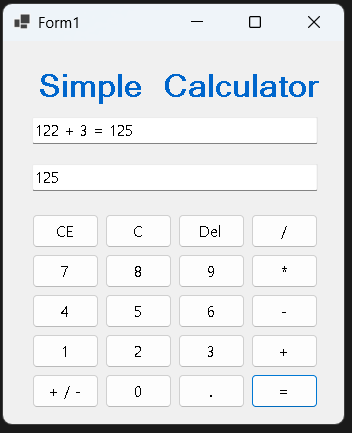
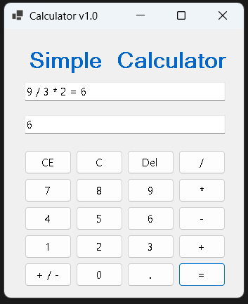
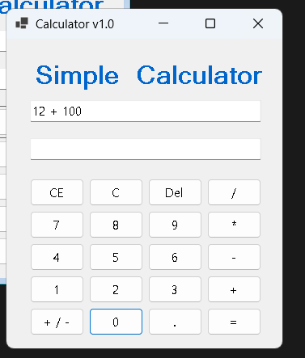
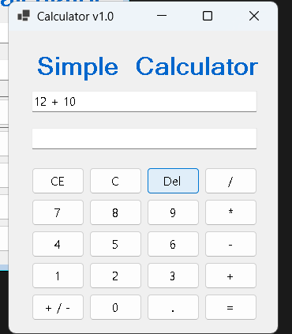
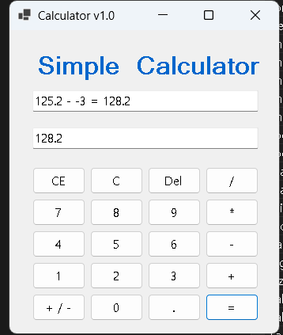
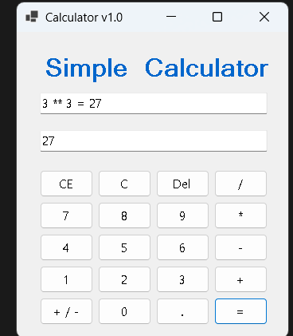
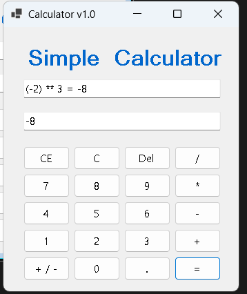

# (C# 코딩) 나만의 계산기 SimpleCalculator
## 개요
- C# 프로그래밍 및 Windows Forms 기반 UI/UX 학습
- 1줄 소개: 사용자의 버튼 입력을 분석하여 사칙연산, 특수 연산(거듭제곱) 및 디테일한 예외 처리를 수행하는 완성형 계산기 프로그램
- 사용한 플랫폼: 
	- C#, .NET Windows Forms, Visual Studio, GitHub
- 사용한 컨트롤: 
	- Button, TextBox
- 핵심 기능:
	- 사칙연산 및 연속 계산: 덧셈(+), 뺄셈(-), 곱셈(*), 나눗셈(/) 기능 지원 및 계산 완료 후 연이은 연산 수행 가능
	- 수정 및 삭제 로직: 전체 초기화(C), 현재 입력값 초기화(CE), 백스페이스(Del) 기능 지원
	- 특수 편의 기능: 소수점(.) 계산, 양수/음수 토글(+/-) 및 음수 입력 시 괄호 자동 삽입 처리
	- 나만의 특수 기능(거듭제곱): * 버튼을 연속으로 2번 입력 시 ** 연산자로 변환되어 제곱(Math.Pow) 계산 수행
	- 예외 처리: 연산자 중복 클릭 방지, 입력값이 없는 상태에서의 연산 방지 등 디버깅을 통한 안정성 확보
- 화면 구성:
	- 입력 과정 창 (상단 TextBox): 사용자가 누른 숫자와 연산자를 조합하여 전체 수식의 진행 상황(예: 5 ** 2 = 25)을 직관적으로 보여줌
	- 결과 표시 창 (하단 TextBox): 현재 입력 중인 숫자(피연산자)를 보여주거나, = 버튼 클릭 시 최종 연산 결과를 단독으로 출력함
	- 버튼 패드 (하단부): 윈도우 기본 계산기를 벤치마킹하여 0~9 숫자 패드와 사칙연산 기호, 제어 버튼(C, CE, Del) 등을 사용자가 조작하기 편한 그리드 형태로 배치함

- 사용한 기술과 구현한 기능:
	- 문자열 파싱(double.Parse) 및 수학 클래스(Math.Pow)를 활용한 데이터 형 변환과 연산 처리
	- 사용자 입력 예외 처리 (연산자 연속 입력 방지, 계산 완료 후 상태 초기화 및 이어서 계산 등)
	- 이벤트 핸들러(Click 이벤트) 통합 관리를 통한 코드 재사용성 및 모듈화 (HandleOperator 함수 등)
	- 문자열 조작(Substring, Remove, StartsWith)을 통한 UI 동적 업데이트 (음수 괄호 처리, 백스페이스 등)

## 실행 화면 (과제1)
- 과제1 코드의 실행 스크린샷

![과제1 실행화면]
- 

- 과제 내용: 
	- 기본 UI 배치 및 기본 덧셈 기능 구현
	- 입력 과정과 결과값을 2개의 분리된 화면(TextBox)에 표시하는 기능 구현

- 구현 내용과 기능 설명:
	- 0~9까지의 숫자 버튼을 NumberButton_Click 이벤트 하나로 통합하여 입력 로직을 효율적으로 구성함.
	- 상단 textBox_input에는 전체 계산식의 진행 과정을 보여주고, 하단 textBox_result에는 = 버튼 클릭 시에만 최종 결과값이 출력되도록 로직을 분리함.
	- = 버튼을 눌러 계산이 완료된 후 새로운 숫자를 입력하면, 이전 수식 뒤에 이어지는 문제를 해결하기 위해 화면과 내부 변수가 깔끔하게 초기화되도록 상태 관리 플래그를 적용함.

## 실행 화면 (과제2)
- 과제2 코드의 실행 스크린샷

![과제2 실행화면]

- 과제 내용: 
	- 사칙연산(+, -, *, /) 완전 구현
	- 연산자 연속 입력 방지 및 프로그램 안정성 강화

- 구현 내용과 기능 설명:
	- 사칙연산 버튼 클릭 시 해당 연산자를 내부적으로 저장하고, 이전에 입력된 값과 연산하여 수식을 이어나갈 수 있도록 중간 계산 로직을 구현함.
	- 연산자가 두 번 이상 연속으로 눌리거나, 숫자가 없는 초기 상태에서 눌려 프로그램에 오류가 발생하는 문제를 조건문을 통한 예외 처리로 완벽히 차단함.
	- 계산 완료 후 연산자를 누르면 이전 결과값을 첫 번째 피연산자로 삼아 연속 계산이 가능하도록 로직을 수정하여 사용자 편의성을 높임.

## 실행 화면 (과제3)
- 과제3 코드의 실행 스크린샷

![과제3 실행화면]

- 과제 내용:
	- 데이터 수정 및 삭제 버튼(CE, C, Del) 기능 추가 구현

- 구현 내용과 기능 설명:
	- C 버튼: 모든 내부 변수와 화면 출력값을 초기화하여 프로그램을 처음 실행한 상태로 완벽히 되돌림.
	- CE 버튼: 기존 연산자는 유지한 채, 가장 최근에 입력 중이던 피연산자만 문자열 단위로 삭제하여 수정할 수 있도록 구현함.
	- Del 버튼: 현재 입력 중인 숫자의 마지막 글자만 하나씩 지우도록 정밀한 삭제 로직을 적용함.
	- 다양한 연산자 조합과 상황을 기준으로 철저히 검증하여, 부분 삭제 후에도 전체 계산 로직이 꼬이지 않도록 버그를 차단함.

## 실행 화면 (과제4)
- 과제4 코드의 실행 스크린샷

![과제4 실행화면]

- 과제 내용: 
	- 사용자 편의 기능(dot, negative) 추가
	- 나만의 특수 기능(거듭제곱 **) 구현 및 구조 리팩토링

- 구현 내용과 기능 설명:
	- dot(.) 버튼: 입력된 숫자에 소수점이 포함되도록 하며, 소수점이 중복 입력되지 않도록 방어 코드를 작성함.
	- negative(+/-) 버튼: 숫자의 양수/음수 상태를 토글(Toggle)하며, 음수일 경우 수식의 가독성을 위해 (-5)처럼 괄호로 감싸서 출력하도록 동적 문자열 조작 로직을 추가함. 초기 입력값이 없을 때 눌러도 (-)가 입력되어 바로 음수 작성이 가능하도록 UX를 개선함.
	- ** (거듭제곱) 기능: * 버튼을 연속으로 두 번 누르면 연산자가 **로 변경되며, Math.Pow를 이용해 제곱 계산을 수행하는 창의적인 기능을 추가함.
	- 음수 값을 제곱할 때 부호 로직이 꼬이는 복합적인 버그를 발견하고, 연산자를 통합 관리하는 HandleOperator() 공통 함수를 새로 생성하여 구조적으로 문제를 완벽히 해결함.
	- 사이즈 비율에 맞춰 버튼 크기도 같이 조정되도록 UI를 개선하여, 다양한 화면 크기에서도 일관된 사용자 경험을 제공하도록 디자인을 다듬음.
	- 루트, ()기능 추가적인 구현 및 UI 개선을 위한 리팩토링을 진행하여, 코드의 가독성과 유지보수성을 크게 향상시킴.
	
## 배운 내용
- UI 화면에 보이는 텍스트와 프로그램 내부에서 계산을 위해 기억하는 데이터(변수)의 상태를 명확히 분리하여 관리하는 방법의 중요성을 깨달았습니다. 단순히 화면의 글자를 이어 붙이는 것을 넘어, 컴퓨터가 피연산자와 연산자의 상태를 정확히 추적하도록 동기화하는 로직 설계법을 배웠습니다.
- 사용자의 예상치 못한 동작(연산자 연속 클릭, 빈 화면에서 삭제 시도, 음수 상태에서의 삭제 등)을 방어하기 위한 예외 처리(Defensive Programming)의 필요성을 뼈저리게 느꼈습니다. 다양한 조건문을 활용해 엣지 케이스(Edge Case)를 차단하면서 프로그램의 퀄리티와 안정성을 크게 높일 수 있었습니다.
- 여러 개의 버튼을 각각의 개별 이벤트로 만들지 않고, 묶어서 하나의 통합된 이벤트 핸들러(Event Handler)로 처리하는 모듈화 기법을 학습했습니다. 또한, 복잡한 연산자 처리 흐름을 제어하기 위해 HandleOperator() 같은 공통 함수를 도입하며 코드를 리팩토링하는 과정을 통해 코드의 중복을 줄이고 유지보수성을 높이는 경험을 했습니다.
- Substring, Remove, StartsWith 등의 문자열 처리 함수를 적극적으로 활용해 화면의 수식을 동적으로 수정하고, 음수에 괄호를 씌웠다 벗기는 등 디테일한 UX를 제어하는 과정에서 C#의 내장 함수 활용 능력이 크게 향상되었습니다.